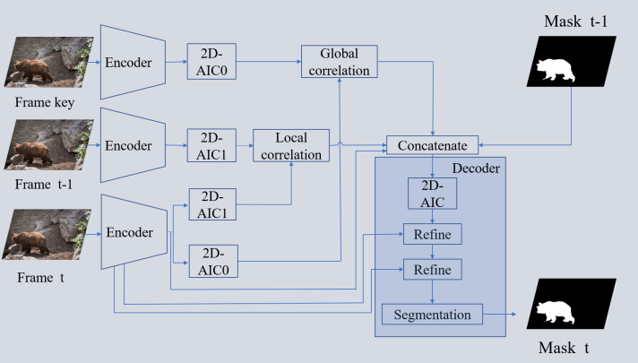

# LSMVOS: Long-Short-Term Similarity Matching for Video Object
## Zhang Xuerui, Yuan Xia
[arxiv](https://arxiv.org/abs/2009.00771)
## Overview

## results
<table border="1">
<tr>
<td>Dataset</td>
<td>J&F↑</td>
<td>J mean↑</td>
<td>J recall↑</td>
<td>J decay↓</td>
<td>F mean↑</td>
<td>F recall↑</td>
<td>F decay↓</td>
<td>FPS↑</td>
</tr>
<tr>
<td>DAVIS 2016 val</td>
<td>86.5</td>
<td>85.7</td>
<td>97.1</td>
<td>5.1</td>
<td>87.3</td>
<td>96.1</td>
<td>4.9</td>
<td>21.3</td>
</tr>
</table>

<table border="1">
<tr>
<td>Dataset</td>
<td>J&F↑</td>
<td>J mean↑</td>
<td>J recall↑</td>
<td>J decay↓</td>
<td>F mean↑</td>
<td>F recall↑</td>
<td>F decay↓</td>
</tr>
<tr>
<td>DAVIS 2017 val</td>
<td>77.4</td>
<td>73.9</td>
<td>83.6</td>
<td>12.9</td>
<td>80.8</td>
<td>91.3</td>
<td>15.7</td>
</tr>
</table>

<table border="1">
<tr>
<td>Dataset</td>
<td>J&F↑</td>
<td>J mean↑</td>
<td>J recall↑</td>
<td>J decay↓</td>
<td>F mean↑</td>
<td>F recall↑</td>
<td>F decay↓</td>
</tr>
<tr>
<td>DAVIS 2017 test</td>
<td>67.4</td>
<td>63.7</td>
<td>72.7</td>
<td>16.9</td>
<td>71.2</td>
<td>81.4</td>
<td>16.5</td>
</tr>
</table>

## Download
[DAVIS](https://share.weiyun.com/nSPPQAV7)

## Visual
[DAVIS 2016 val](https://www.bilibili.com/video/BV1jK4y1Y7yd/)
 
[DAVIS 2017 val](https://www.bilibili.com/video/BV1MC4y1t7R2/)
 
[DAVIS 2017 test](https://www.bilibili.com/video/BV1Bh411d72y/)
