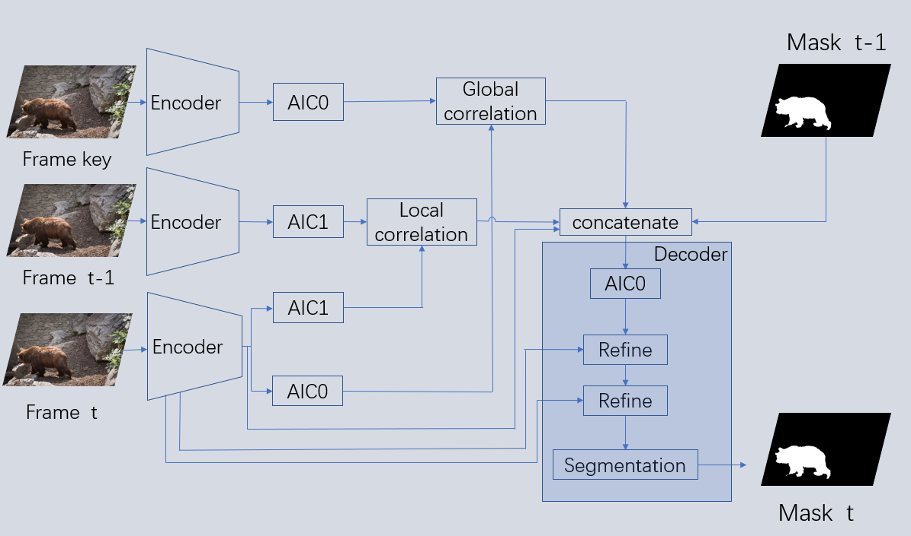

# 基于长-短时相似性匹配的视频目标分割网络
## 网络结构

# 实验结果
<table border="1">
<tr>
<td>数据集</td>
<td>J&F↑</td>
<td>J mean↑</td>
<td>J recall↑</td>
<td>J decay↓</td>
<td>F mean↑</td>
<td>F recall↑</td>
<td>F decay↓</td>
<td>FPS↑</td>
</tr>
<tr>
<td>DAVIS 2016 val</td>
<td>86.5</td>
<td>85.7</td>
<td>97.1</td>
<td>5.1</td>
<td>87.3</td>
<td>96.1</td>
<td>4.9</td>
<td>21.3</td>
</tr>
</table>

<table border="1">
<tr>
<td>数据集</td>
<td>J&F↑</td>
<td>J mean↑</td>
<td>J recall↑</td>
<td>J decay↓</td>
<td>F mean↑</td>
<td>F recall↑</td>
<td>F decay↓</td>
</tr>
<tr>
<td>DAVIS 2017 val</td>
<td>77.4</td>
<td>73.9</td>
<td>83.6</td>
<td>12.9</td>
<td>80.8</td>
<td>91.3</td>
<td>15.7</td>
</tr>
</table>

<table border="1">
<tr>
<td>数据集</td>
<td>J&F↑</td>
<td>J mean↑</td>
<td>J recall↑</td>
<td>J decay↓</td>
<td>F mean↑</td>
<td>F recall↑</td>
<td>F decay↓</td>
</tr>
<tr>
<td>DAVIS 2017 test</td>
<td>67.4</td>
<td>63.7</td>
<td>72.7</td>
<td>16.9</td>
<td>71.2</td>
<td>81.4</td>
<td>16.5</td>
</tr>
</table>

# 下载
[DAVIS 分割结果](https://share.weiyun.com/nSPPQAV7)

# 可视化结果

 <video width="320" height="240" controls="controls">
        <source src="视频/DAVIS 2016 val.mp4" type="video/mp4">
 </video>
